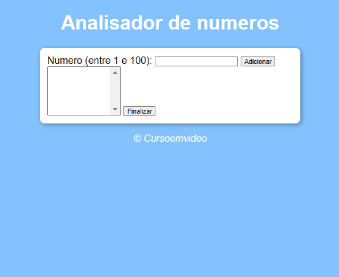
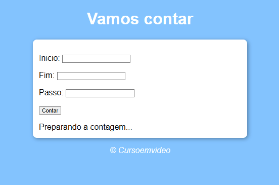
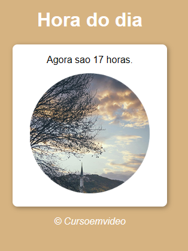
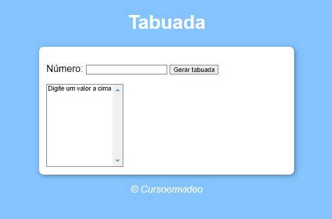
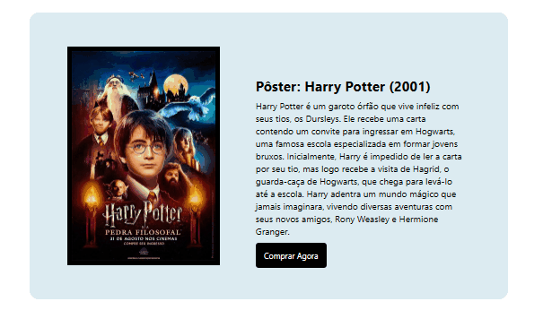
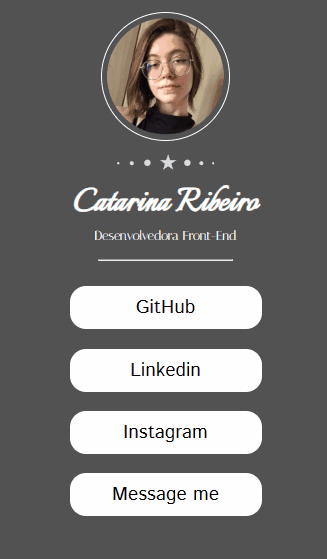

# 💻 Meu Aprendizado em Programação

Bem-vindo ao meu repositório de estudos! Aqui compartilho o que estou aprendendo e praticando na área de programação, com foco em JavaScript, React, HTML/CSS e Design de UI/UX. 🚀

# 📚 O que já aprendi

## 🌟 JavaScript (Curso em Vídeo)

-Fundamentos da linguagem: variáveis, operadores e estruturas de controle

-Manipulação do DOM

-Funções, arrays e objetos

-Eventos e interatividade em páginas web

## Alguns projetos feitos: 

[] [] [] []

## ⚛️ React

-Componentes e props

## Alguns projetos feitos:
[] [] []

## 🔄 O que estou revisando

🖌️ HTML e CSS (Curso do Dev em Dobro)

-Semântica do HTML

-Flexbox e Grid Layout para posicionamento

-Responsividade: mobile-first e media queries

## 🎨 Design UI/UX

-Princípios básicos de design de interfaces

-Acessibilidade e experiência do usuário

-Protótipos e wireframes usando Figma

-Uso de cores, tipografia e hierarquia visual para criar designs intuitivos

# Unico Projeto feito usando o FIGMA: 
[]

## 💡 Como estou organizando os estudos

-Desafios Práticos: mini-projetos para aplicar os conceitos aprendidos

-Anotações: resumos e dicas úteis durante o aprendizado

-Portfólio: criações e designs que destacam o que já aprendi

-Sinta-se à vontade para explorar o repositório, deixar comentários e sugestões. Feedback é sempre bem-vindo! 😊

# 🚀 Vamos crescer juntos?

-💬 Me chame para conversar sobre programação, design ou compartilhar ideias.
